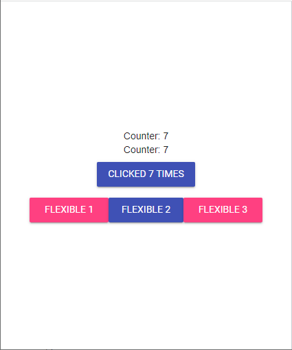

# dawui
Lighweight web ui framework for dart inspired by flutter

# Goal
Dawui should be a lighweight web ui framework simliar to Flutter.

For creating websites, Flutter is quite overkill for such task.

Therefore i thought, wouldn't it be nice, to just have a small and lightweigt web ui framework that feels like Flutter and behaves similar to Flutter.

And with that idea in mind, i started working on Dawui (`Da`rt `W`eb `ui`).

Dawui should mimik Flutter in areas where it makes sense, when it doesn't make sense, Dawui will differ to match specific web needs.

Dawui comes with a simple state management system: you define an Observable and bind it to a Widget. When ever you change the Observable's value, this widget gets redrawn. This differs from Flutter where you have to override the `setState` Method of a StatefullWidget. Since Dawui does not distinguish betwenn Widgets with state and without state, you can make your statefull values (Observables) change the Widget. This is alot more flexible since you can basically trigger a redraw from everywhere.

# Road
First step to have a starting point, is to implement all the Elements that are available in [mdl](https://getmdl.io/components/index.html#dialog-section)

A Flutter like Theming should be implementd.

## Example
```dart
import 'package:dawui/dawui.dart';

void main() {
  runApp((Map<String, String> args) => MainApp());
}

class MainApp extends Widget {
  final counter = Observable(0);

  @override
  Widget build() {
    return Column(
      mainAxisAlignment: MainAxisAlignment.center,
      children: [
        // Both work the same
        counter.observe((_) => Text("Counter: ${counter.value}")),
        counter.observe((value) => Text("Counter: $value")),
        SizedBox(height: "8px"),
        Row(
          mainAxisAlignment: MainAxisAlignment.center,
          children: [
            ColoredButton(
              child: counter.observe((value) => Text("Clicked $value times")),
              onPressed: (Widget sender) {
                counter.value += 1;
              },
            ),
          ],
        ),
        SizedBox(height: "16px"),
        Container(
          width: "80%",
          child: Row(
            children: [
              Flexible(
                flex: 2,
                child: AccentButton(child: Text("Flexible 1"), width: "100%"),
              ),
              Flexible(
                flex: 1,
                child: ColoredButton(child: Text("Flexible 2"), width: "100%"),
              ),
              Flexible(
                flex: 2,
                child: AccentButton(child: Text("Flexible 3"), width: "100%"),
              ),
            ],
          ),
        ),
      ],
    );
  }
}

```



## to be continued
